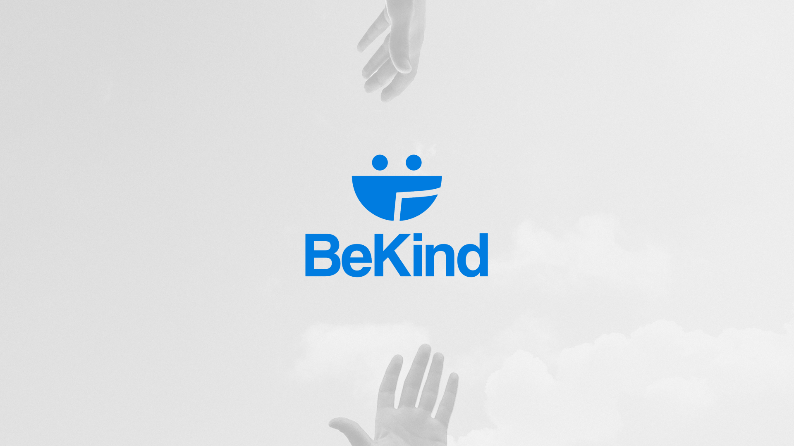

# 🫂 BeKind - Plataforma de Ajuda Social

Bem-vindo ao repositório da BeKind! Esta é uma plataforma em desenvolvimento que busca ajudar moradores de rua e pessoas em situação de vulnerabilidade, fornecendo suporte, recursos e conscientização sobre questões sociais. Este projeto foi criado como parte do meu projeto de conclusão de curso.

  

## 💙 Objetivo

O objetivo da BeKind é promover a solidariedade, a empatia e a compaixão em relação às pessoas em situação de vulnerabilidade. A plataforma visa conectar voluntários, vulneráveis e organizações que desejam fazer a diferença na vida dessas pessoas, fornecendo uma maneira fácil e eficiente de contribuir para a causa social.

  

## 📱 Funcionalidades Principais

- Cadastro de vulneráveis, permitindo que eles recebam um melhor acompanhamento e suporte por meio de ONGs próximas e de voluntários da plataforma.
- Registro de doações, permitindo que os usuários doem roupas, alimentos, dinheiro e outros itens essenciais para aqueles em necessidade.
- O blog, um espaço dedicado às organizações não governamentais (ONGs) para compartilharem informações sobre suas atividades, metas e projetos.
- Calendário de eventos, para manter os usuários atualizados sobre oportunidades de participação e ações promovidas pela BeKind e por outras organizações parceiras.

## 📞 Contato

Se você tiver alguma dúvida, sugestão ou feedback, sinta-se à vontade para entrar em contato conosco:

- E-mail: bekindtcc@gmail.com
- Instagram: @bekind.initiative